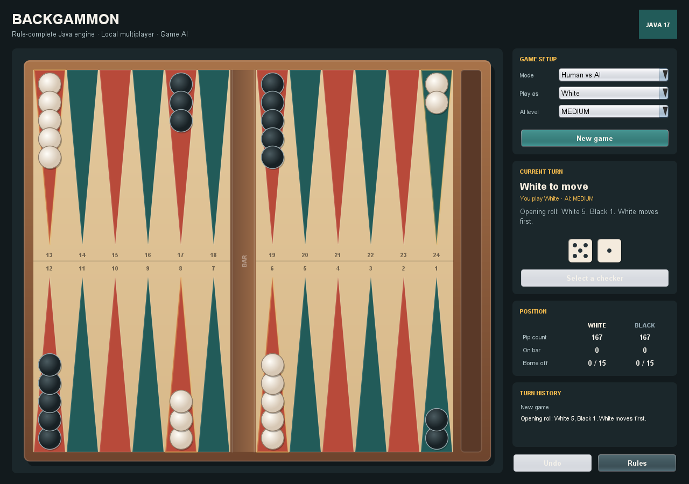

# Backgammon Java

[](https://github.com/BridgeSword/backgammon-java/actions/workflows/ci.yml)

A desktop Backgammon game with a rules-complete Java engine, local multiplayer, and three computer-player difficulties. The project separates immutable game state and move generation from its Swing interface, which keeps the rules testable without launching a window.

> This repository is a clean, tested reconstruction of the Backgammon project I originally built in Fall 2024, prepared for portfolio review.



## Highlights

- Full 24-point board state with bar and bear-off trays
- Legal move generation for hits, blocked points, forced bar entry, and bearing off
- Correct turn-level dice rules: four moves for doubles, maximum dice usage, and the higher-die rule
- Local two-player and human-vs-computer modes
- Easy, Medium, and Hard AI strategies with deterministic random injection for testing
- Interactive Swing board with legal-move highlighting and a turn history
- Automated JUnit tests and a cross-platform GitHub Actions build

## Quick start

Requirements: JDK 17 or newer. No JavaFX installation or external runtime libraries are needed.

macOS/Linux:

```bash
git clone https://github.com/BridgeSword/backgammon-java.git
cd backgammon-java
./gradlew run
```

Windows PowerShell:

```powershell
git clone https://github.com/BridgeSword/backgammon-java.git
cd backgammon-java
.\gradlew.bat run
```

The first Gradle Wrapper run downloads the pinned Gradle distribution and test dependencies.

## Playing

Choose **Human vs AI** or **Local two player**, select an AI difficulty when applicable, and start a new game. The opening roll is made automatically according to standard Backgammon rules. During a human turn:

1. Select a highlighted checker (or the bar when a checker must re-enter).
2. Select one of the highlighted destinations.
3. If two dice can produce the same bear-off move, choose the die when prompted.
4. Press **Roll** at the start of each later turn.

The engine only exposes moves that can begin a legal maximum-length sequence, so the interface cannot accidentally let a player waste a usable die.

## AI

| Difficulty | Selection strategy |
| --- | --- |
| Easy | Uniform random legal turn |
| Medium | Heuristic evaluation of pip count, safety, hits, made points, bar pressure, and borne-off checkers |
| Hard | Heuristic search that also evaluates the opponent's weighted dice outcomes and best replies |

All AI levels choose from the same rule engine used to validate human input.

## Architecture

```text
Swing UI
   |
GameSession          turn lifecycle, dice, history, winner detection
   |
BackgammonRules      legal sequences and rule enforcement
   |
Immutable model      Board, Move, Dice, snapshots
   |
Backgammon AI        legal sequence scoring and opponent-response search
```

The game engine has no Swing dependency. Custom positions can be constructed in tests, and every applied move returns a new board state rather than mutating a shared board.

## Build and test

```bash
./gradlew clean build
```

The build produces:

- Runnable JAR: `build/libs/backgammon-java-1.0.0.jar`
- Source and Javadoc JARs: `build/libs/backgammon-java-1.0.0-{sources,javadoc}.jar`
- Test report: `build/reports/tests/test/index.html`
- JaCoCo coverage report: `build/reports/jacoco/test/html/index.html`

Run the JAR with:

```bash
java -jar build/libs/backgammon-java-1.0.0.jar
```

## Rules scope

The game implements standard checker movement and single-game scoring (single, gammon, and backgammon). Match play, the doubling cube, the Crawford rule, and network multiplayer are intentionally outside this project's scope.
